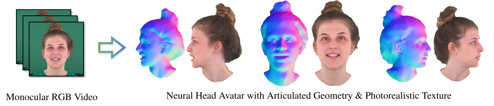
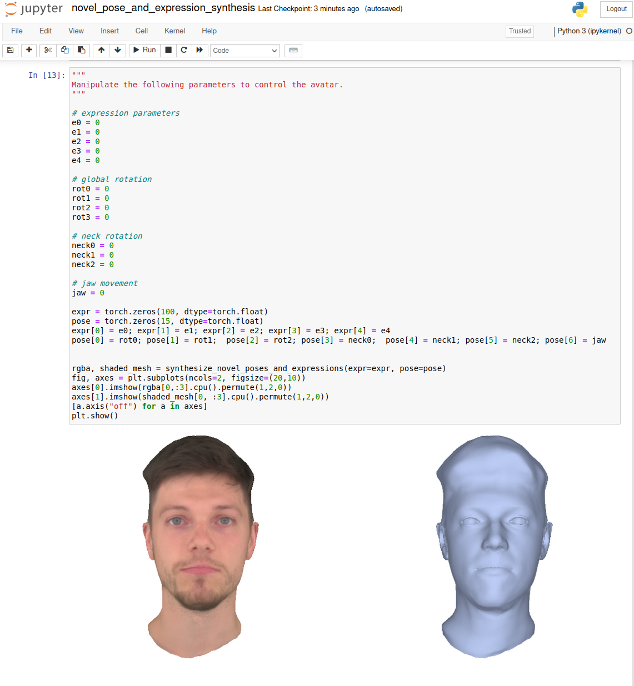

# Neural Head Avatars from Monocular RGB Videos <br><sub>Official PyTorch implementation of the CVPR 2022 paper ([Project Page](https://philgras.github.io/neural_head_avatars/neural_head_avatars.html))</sub>
Philip-William Grassal\*, Malte Prinzler\*, Titus Leistner, Carsten Rother, Matthias Nießner, Justus Thies<br>
<sub>\*equal contribution<sub><br>


<br><br>


<br><br>

Abstract: We present Neural Head Avatars, a novel neural representation that explicitly models the surface geometry and appearance of an animatable human avatar that can be used for teleconferencing in AR/VR or other applications in the movie or games industry that rely on a digital human. Our representation can be learned from a monocular RGB portrait video that features a range of different expressions and views. Specifically, we propose a hybrid representation consisting of a morphable model for the coarse shape and expressions of the face, and two feed-forward networks, predicting vertex offsets of the underlying mesh as well as a view- and expression-dependent texture. We demonstrate that this representation is able to accurately extrapolate to unseen poses and view points, and generates natural expressions while providing sharp texture details. Compared to previous works on head avatars, our method provides a disentangled shape and appearance model of the complete human head (including hair) that is compatible with the standard graphics pipeline. Moreover, it quantitatively and qualitatively outperforms current state of the art in terms of reconstruction quality and novel-view synthesis.
<br><br>


<br>
<br>

## Installation

- Install Python3.9 following the instruction on https://www.python.org/
- ```git clone --recursive https://github.com/philgras/neural-head-avatars.git ```
- ```cd neural-head-avatars```
- ```pip install -e .```
- Add ```generic_model.pkl``` obtained from the [MPI website](https://flame.is.tue.mpg.de/) to ```./assets/flame```.
- Optional for training: Add the arcface model weights used for the perceptual energy term as ```backbone.pth``` to ```./assets/InsightFace```. The checkpoint can be downloaded from the [ArcFace repo](https://github.com/deepinsight/insightface/tree/c85f5399836b604611057e194a3c30230053c490/recognition/arcface_torch)
by looking for the ms1mv3_arcface_r18_fp run. To ease the search, this is the OneDrive [link](https://onedrive.live.com/?authkey=%21AFZjr283nwZHqbA&id=4A83B6B633B029CC%215578&cid=4A83B6B633B029CC) provided by their Readme. Download the ```backbone.pth``` from there.
- Optional for processing your own videos:
    - Add ```rvm_mobilenetv3.pth``` obtained from [here](https://github.com/PeterL1n/RobustVideoMatting/tree/81a10937c73f68eeddb863221c61fe6a60a1cca2) to ```./assets/rvm``` for background matting ([direct link](https://github.com/PeterL1n/RobustVideoMatting/releases/download/v1.0.0/rvm_mobilenetv3.pth)).
    - Add ```model.pth``` obtained from [here](https://github.com/boukhayma/face_normals/tree/5d6f21098b60dd5b43f82525383b2697df6e712b) to ```./assets/face_normals``` for face normal map prediction ([direct link](https://drive.google.com/file/d/1Qb7CZbM13Zpksa30ywjXEEHHDcVWHju_)).
    - Add ```model.pth``` obtained from [here](https://github.com/zllrunning/face-parsing.PyTorch/tree/d2e684cf1588b46145635e8fe7bcc29544e5537e) to ```./assets/face_parsing``` for facial segmentation ([direct link](https://drive.google.com/open?id=154JgKpzCPW82qINcVieuPH3fZ2e0P812)).
    - Run `pip install -e deps/video-head-tracker` to install the FLAME tracker.  Download the flame
     head model and texture space from the official [website](https://flame.is.tue.mpg.de/)
     and add them as ```generic_model.pkl``` and ```FLAME_texture.npz``` under ```./assets/flame```.
     Go to ```https://github.com/HavenFeng/photometric_optimization``` and copy the uv
     parametrization ```head_template_mesh.obj``` of FLAME found
     [there](https://github.com/HavenFeng/photometric_optimization/blob/master/data/head_template_mesh.obj)
     to ```./assets/flame```, as well. (This is basically what the README of the flame tracking repo
     tells you.)
<br>

## Downloadable Content
This repository is accompanied by preprocessed training data, head tracking results and optimized avatars for two subjects. Please download the zipped files from [here](https://edmond.mpdl.mpg.de/api/access/datafile/182303). The archive contains three folders: ```data``` contains preprocessed training files, ```nha``` contains the optimized head avatars, and ```tracking``` contains head tracking results.


## Quickstart



Novel pose and expression synthesis with a pretrained model

- Download a pretrained model from [here](https://edmond.mpdl.mpg.de/api/access/datafile/182303) and move the optimized avatar (.ckpt) and head tracking (.npz) files to ```./pretrained_models```
- run ```jupyter notebook jupyter_notebooks```
- Open the ```novel_pose_and_expression_synthesis.ipynb``` notebook
- You can now play around with the expression and pose parameters for a pretrained avatar

<br>
<br>

## Optimizing an Avatar Against a Monocular RGB Video
Please follow these steps to optimize a new avatar from scratch against a monocular .mp4 video. Make sure that only one subject is visble in every frame and that the head is turned in both directions up to profile views in order to provide enough information for the avatar optimization.
We provide preprocessed videos, FLAME head trackings and optimized avatar checkpoints for
two of our subjects from the paper [here](https://edmond.mpdl.mpg.de/api/access/datafile/182303).

1. Video Preprocessing
   - If you would like to use your own video, make sure you installed the required dependencies from above.
   - Run ```python python_scripts/video2dataset.py --video PATH_TO_VIDEO --out_path PATH_TO_OUTPUT_DIR```
    - Important: Make sure to crop the video tightly around the head as in the paper. Otherwise the generated ground truth is not as accurate and the optimization later on uses only a small part of each frame.
    <br>
    This script will automatically extract all necessary data including segmentations, normal maps and so on. While not beeing strictly necessary, we recommend using square videos captured at 25 fps at a resolution of 512x512 px.


2. Head Tracking

    - Adapt the config file `configs/tracking.ini` and make sure to change the following values according to your needs.
      Note you can also set them on the command line by preceding each parameter name with `--`.

          data_path ... Path to the preprocessed dataset (e.g. data/own_dataset)

          output_path ... Path to output all results including tracked head model parameters, visualizations, logs, ... (e.g. data/own/dataset/tracking_results)

          keyframes ... List of frame indices in the sequence dataset to initialize the FLAME texture and shape parameters against. Select frames that show the head from different angles and with approximately neutral expression.

    - Run ```python deps/video-head-tracker/vht/optimize_tracking.py --config configs/tracking.ini```
    - Note: If you point Tensorboard to `output_path`, you can follow the optimization.

    <br>

3. Avatar Optimization

   - Adapt the split config file at ```configs/split.json``` to specify which frames to use for training and which for validation

   - Adapt the config file at ```configs/optimize_avatar.ini``` according to your needs. Make sure to change the parameters:

         default_root_dir ... Path to directory to store the results in (e.g. experiments/optimized_avatars)

         data_path ... Path to dataset (e.g. data/own_dataset)

         split_config ... Path to split config (e.g. configs/split.json)

         tracking_results_path``` ... Path to the file containing the tracked flame parameters (e.g. data/own_dataset/tracking_results/tracking_1/tracked_params.npy)

   - If you desire to make any changes to the other parameters please note two details:

      * The parameters ```train_batch_size, validation_batch_size, *_lr``` and most of the loss weights are defined as tuples of three values. Each value corresponds to one stage of optimization, namely, geometry optimization, texture optimization, and joint optimization respectively.

      * The parameters ```w_semantic_hair, w_silh, w_lap``` change smoothly during training and are specified through lists of tuples with two entries. The first tuple entry specifies the weight value, the second specifies the epoch. Inbetween the so-defined fixpoints, the values are interpolated.

   - Run ```python python_scripts/optimize_nha.py --config configs/optimize_avatar.ini```

   - After the optimization is finished, the trained model is stored in the directory specified via ```default_root_dir``` alongside with qualitative and quantitative evaluations.

   - Note the GPU requirements in the paper. If you have less resources available, try reducing the batch size, image resolution and capacities of the MLPs.
    - Note: If you point Tensorboard to `default_root_dir`, you can follow the optimization.
<br>

## Reenacting an Optimized Avatar

To transfer the facial movement from one avatar to another, please follow the following steps.

- Optimize one avatar for the target identity and one for the driving sequence. Alternatively, you can also download the reconstructed avatars and head trackings from [here](https://edmond.mpdl.mpg.de/api/access/datafile/182303).
- Adapt the ```configs/reenactment.ini``` config file. Make sure to change the following arguments according to your needs
    - ```target_model``` ... ckpt file of the optimized avatar (e.g. experiments/target_avatar.ckpt)
    - ```source_model``` ... ckpt file of the optimized avatar (e.g. experiments/source_avatar.ckpt)
    - ```neutral_target_frame``` ... frame index for neutral facial expression in target training sequence
    - ```neutral_source_frame``` ... frame index for neutral facial expression in source training sequence
    - ```outpath``` ... output file to store results in (must end on .mp4)
- Run ```python python_scripts/reenact_avatar.py --config configs/reenactment.ini```


----------------------------------------------------------------------------------------------------------

## License
The code is available for non-commercial scientific research purposes under the [CC BY-NC 3.0 license](https://creativecommons.org/licenses/by-nc/3.0/legalcode). Please note that the files [flame.py](./nha/models/flame.py) and [lbs.py](./nha/util/lbs.py) are heavily inspired by https://github.com/HavenFeng/photometric_optimization and are property of the Max-Planck-Gesellschaft zur Förderung der Wissenschaften e.V. The download, use, and distribution of this code is subject to this [license](https://github.com/vchoutas/smplx/blob/master/LICENSE). The files that can be found in the [./assets](./assets) directory, are adapted from the [FLAME head model](https://flame.is.tue.mpg.de) for which the license can be found [here](https://flame.is.tue.mpg.de/modellicense.html).


## Citation

**If you find our work useful, please include the following citation:**


```
@article{grassal2021neural,
  title={Neural Head Avatars from Monocular RGB Videos},
  author={Grassal, Philip-William and Prinzler, Malte and Leistner, Titus and Rother, Carsten and Nie{\ss}ner, Matthias and Thies, Justus},
  journal={arXiv preprint arXiv:2112.01554},
  year={2021}
}

```

Parts of our code are heavily inspired by https://github.com/HavenFeng/photometric_optimization.git so please also consider citing their work as well as the underlying FLAME head model for which an up-to-date bibtex can be found [here](https://flame.is.tue.mpg.de/).


## Acknowledgements

This project has received funding from the DFG in the joint German-Japan-France grant agreement (RO 4804/3-1) and the ERC Starting Grant Scan2CAD (804724). We also thank the Center for Information Services and High Performance Computing (ZIH) at TU Dresden for generous allocations of computer time.
